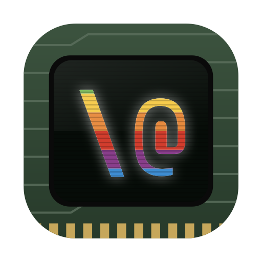
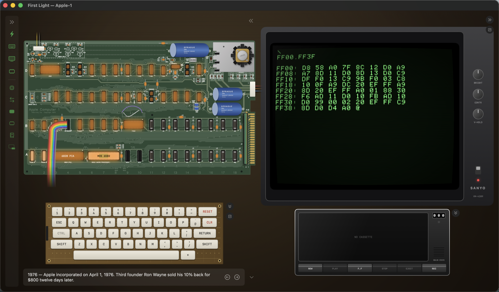

<p align="center"></p>

# First Light

A living Apple-1 for Apple's 50th anniversary. A native Mac app where the
1976 machine's board is visible chip-by-chip, peripherals connect by
drag-and-drop, and guided demos show what the $666.66 computer could do —
backed by a real, cycle-counted emulation.

Status: the full bench. The board is rendered from the original
fabrication files (copper, silkscreen, drill, outline gerbers) with
every chip socketed, pullable, and failing the way real hardware fails.
Around it: a Datanetics-style keyboard (clickable, era thock, no
auto-repeat — just like the real one), a Sanyo-style monitor with
working knobs (V-HOLD included) that detaches into its own window, and
a cassette deck that plays each tape's ACTUAL BYTES as bit-true ACI
audio while it loads. The cassette library holds the official 1976
catalog (Hamurabi, Microchess, Lunar Lander, Mini-Startrek, Mastermind,
the Dis-Assembler, the Extended Monitor, Integer BASIC) plus modern
homebrew — all machine-verified by `Scripts/verify-tapes.sh`. ⌘K opens
a command palette that types 1976 syntax for you; ⌘/ is the quick
reference; ⌘F is full-screen phosphor. See [docs/PLAN.md](docs/PLAN.md).



## Install

Download the latest notarized build from
[Releases](https://github.com/d4rkwyng/first-light/releases) — or build it
yourself below. Requires macOS 15 or later. Or:

```sh
brew install --cask d4rkwyng/tap/first-light
```

## Build & test

Works with Command Line Tools only (no Xcode required):

```sh
./Scripts/test.sh                 # run the core test suite
./Scripts/build-app.sh            # build dist/First Light.app
./Scripts/build-app.sh --install  # ...and copy to /Applications
swift run FirstLight              # or just run it directly
```

In the app: type at the Woz Monitor (try `FF00.FFFF`), ⌘B drops Integer
BASIC into RAM and starts it, ⌘R resets. Esc cancels a monitor line;
Delete sends `_`, the Apple-1's rubout.

## Credits & legal

First Light's own code is [MIT](LICENSE). The MIT license covers only our
original code — bundled historical ROM images, software cassettes, fonts,
board fabrication data, and photographs have their own owners and terms;
the full provenance record is in [NOTICE.md](NOTICE.md). The short version:

- 6502 core: [fake6502](http://rubbermallet.org/fake6502.c) v1.1 by Mike
  Chambers (public domain).
- Woz Monitor and Apple Integer BASIC are © Apple. They have circulated
  freely in the Apple-1 preservation community for decades and are included
  for education and preservation. Not affiliated with Apple Inc.
- Era software and cassette images collected from the Apple-1
  community: the Apple-1 Software Library (apple1software.com),
  Mike Willegal (willegal.net), and Applefritter.
- Apple-1 PCB gerbers from the Applefritter A1replica project; ACI
  card gerbers from github.com/kalinchuk/apple_1. The board you see is
  rendered from those fabrication files.
- 2513 character ROM glyphs from the P-LAB dump (CC BY 4.0).
- Photos (all CC BY-SA, Wikimedia Commons): Ed Uthman (Smithsonian
  Apple-1), Arnold Reinhold (Woz's Apple-1 at CHM), Jordiipa (CHM
  Apple-1), Sergei Magel/HNF (Heinz Nixdorf MuseumsForum setup).
